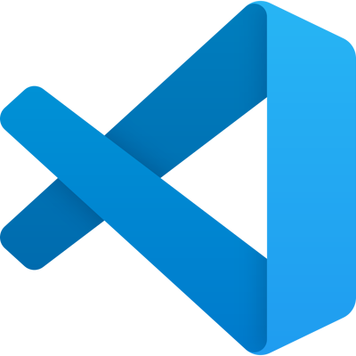
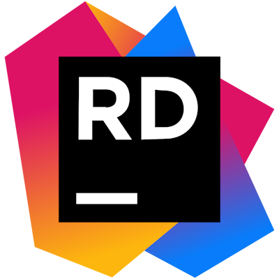

# Hi! I'm Hendrix Huang 👾

Hi! I'm Hendrix. I love researching tools, solving problems, writing small projects, creating educational blogs, and editing videos. Helping others solve their issues always fills me with positive energy. I enjoy collaborating with others to solve challenging problems and welcome all kinds of collaboration opportunities.

嗨！我是黃紅橙，喜歡研究工具、解決問題，自己會寫一些小專案、教學 Blog、剪輯影片，幫別人解決問題總是能帶給我滿滿的正能量，喜歡和他人合作、一同解決難題，歡迎各種形式的合作邀約~

* 📫 **Contact me / 聯絡我:** <a href="mailto:yellowredorange1999@gmail.com" target="_blank">yellowredorange1999@gmail.com</a>
* 📝 **Check out my latest articles on my blog / 查看我的最新文章:** <a href="https://yellowredorange.com/" target="_blank">yellowredorange.com</a>
* 🚀 **Currently working on / 目前的在做的專案:** <a href="https://mompos.yellowredorange.com/" target="_blank">MomPos (Demo)</a>

### Skills

### Socials

 

 

# My Projects

## <a href="https://mompos.yellowredorange.com/#/" target="_blank">MomPos</a>

### Multifunctional, Cross-Device Online Ordering Website

MomPos is an online ordering website that on one hand provides restaurateurs with a convenient and fast way to build and edit menus, manage customer data, and on the other hand allows customers to log in, place orders online, and includes features like Responsive Web Design (RWD) and permission management.

### Every mom says it's the best POS system 👍

The entire project was inspired by my mom, with the hope of creating a POS system so simple and user-friendly that even my mom would say it's easy to use. I hope that MomPos can be as meticulous and thoughtful as a mother, helping you save time and precisely manage the marketing within your establishment.

### 多功能、跨裝置的線上點餐網站 
MomPos 是一個點餐網站，一方面用提供餐飲業者方便又快速的建立編輯菜單、管理客戶資料，另一方面能讓顧客登入會員、線上點餐，具備 RWD、權限管理等功能。

### 每位媽媽都說好用的 Pos 系統👍
整個專案的靈感是由我媽出發，我希望能打造連我媽都說簡單好用的 POS 系統，也希望 MomPos 就像媽媽一樣的精打細算、細心周到，幫你省下時間，及精確的掌握店內營銷。

